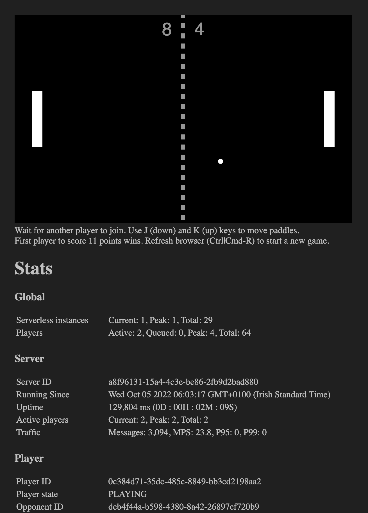

# Cloud Pong

This demo is meant to be a fun retro nod to [Pong], a classic table tennis style
game with two paddles and a ball. It was the first video game to achieve
commercial success and is indelibly imprinted as an iconic example of the early
[arcade] game industry.

This version is meant to be played over the web. Wireframes of the desired user
experience are located under [doc/design].

The demo shows how to create a serverless web app (deployed to Cloud Run) with
bidirectional streaming (using websockets) and distributed game state storage
and synchronization using Redis.

### Non-goals, limitations, and constraints

As a technology demo, the game should be amusing to play, although creating a
real-world production gaming application is a non-goal.

As a browser-based game, optimizations (such as using UDP packets or gRPC
bidirectional streaming) aren't available.

Techniques, such as using prediction to mitigate latency, could potentially be
explored, but (at least for now) the game will have the constraint that players
will be matched from the same region only.

## Running the app

### To run locally:

```text
npm run dev
```

### To deploy:

Prerequisites

1. [Create an account and a database on Upstash](https://docs.upstash.com/redis)
   .

   Choose the regional database: `US-CENTRAL-1. This is currently the only
   choice for Upstash. This region generally should coincide with the
   [Google Cloud region](https://cloud.google.com/compute/docs/regions-zones)
   that you'll use for Cloud Run for optimal performance. Don't choose the
   Global option.
2. [Select or create a Cloud Platform project](https://console.cloud.google.com/project)
   .
3. [Enable billing for your project](https://support.google.com/cloud/answer/6293499#enable-billing) (
   learn more about [Google's Free Tier](https://cloud.google.com/free)).

Set environment variables for

* `PROJECT`
* `REGION`
* `SERVICE`
* `REDIS`

For example:

```text
export PROJECT=my-cloud-pong-project
export REGION=us-central1
export SERVICE=pong
export REDIS=redis://:PASSWORD@gusc1-whole-stork-30425.upstash.io:30425
```

From the project root directory, run the following script and enable APIs, as
prompted:

```text
scripts/run-deploy
```

After a successful deployment, the application URL will be printed to the
output.




<!-- reference links -->

[doc/design]: https://github.com/subfuzion/cloudpong/tree/main/doc/design

[arcade]: https://en.wikipedia.org/wiki/Arcade_game

[Pong]: https://en.wikipedia.org/wiki/Pong
